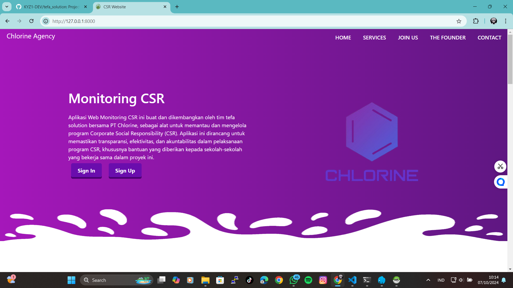
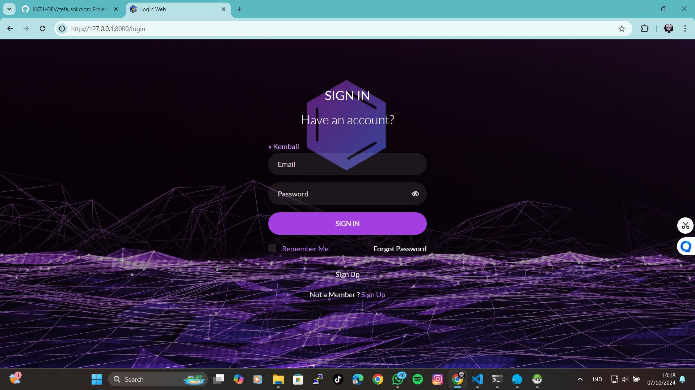
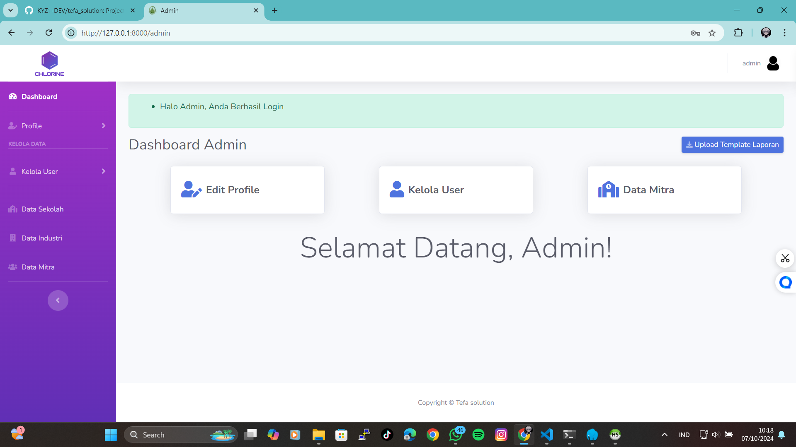
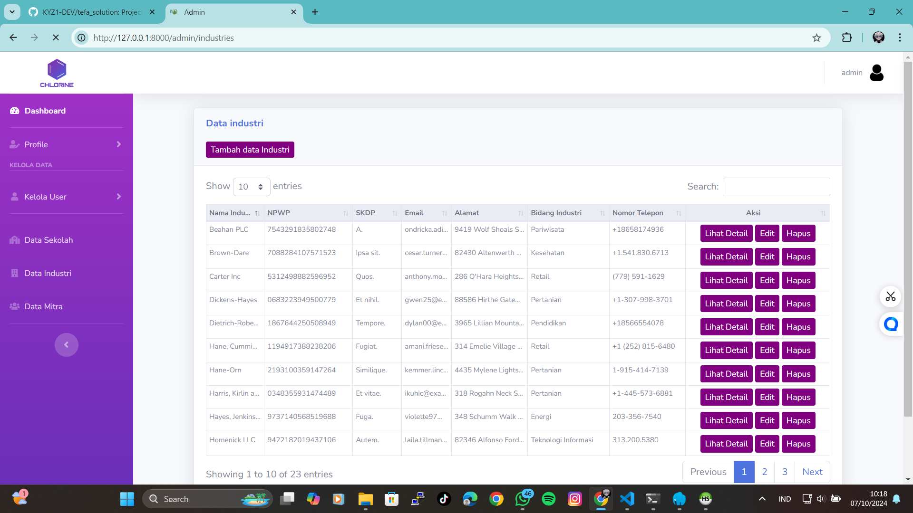

# Nama Aplikasi


Deskripsi singkat aplikasi Anda, apa yang dilakukan dan tujuan utama aplikasi.

## deskripsi

Situs web CSR Bantuan dari Industri adalah platform yang dirancang untuk mengelola dan menampilkan program Corporate Social Responsibility (CSR) yang diberikan oleh perusahaan-perusahaan industri kepada masyarakat dan lingkungan sekitar. Web ini berfungsi sebagai media transparansi dan interaksi antara perusahaan dan penerima manfaat, dengan tujuan utama untuk meningkatkan dampak positif dari program CSR yang dijalankan.

Fitur Utama:
Informasi Program CSR: Web ini menampilkan informasi lengkap tentang berbagai program CSR yang sedang berjalan atau yang telah selesai dilaksanakan oleh industri, termasuk program bantuan pendidikan, kesehatan, infrastruktur, serta lingkungan hidup. Setiap program dilengkapi dengan deskripsi, tujuan, durasi, dan area yang menjadi fokus.

Pengajuan Bantuan: Platform ini menyediakan fitur untuk individu atau organisasi yang memenuhi syarat agar dapat mengajukan permohonan bantuan CSR secara online. Pengguna dapat mengisi formulir, mengunggah dokumen pendukung, dan melacak status pengajuan mereka melalui sistem.

Laporan dan Dokumentasi: Setiap program CSR dilengkapi dengan laporan perkembangan dan dokumentasi berupa foto atau video kegiatan yang sudah dilakukan. Hal ini memastikan bahwa publik dapat memantau dampak nyata dari bantuan yang diberikan oleh industri.

Profil Industri dan Komitmen CSR: Setiap perusahaan industri yang terlibat memiliki halaman profil yang menjelaskan komitmen mereka terhadap CSR, area fokus mereka (misalnya, pendidikan, kesehatan, pemberdayaan masyarakat), serta jumlah investasi yang telah dialokasikan untuk program-program tersebut.

Transparansi dan Akuntabilitas: Web ini mendukung transparansi dengan mempublikasikan laporan keuangan dan evaluasi kinerja setiap program CSR yang dilakukan. Publik dapat melihat detail alokasi dana dan capaian yang telah dihasilkan dari setiap bantuan.

Portal Donatur: Selain menampilkan program dari perusahaan industri, situs ini juga memungkinkan pihak ketiga, seperti individu atau organisasi non-industri, untuk turut serta mendonasikan dana atau sumber daya yang mendukung program CSR yang sedang berlangsung.

Berita dan Update CSR: Web ini juga memiliki bagian berita dan update yang memuat informasi terbaru tentang program CSR, termasuk kerja sama antar industri, penghargaan terkait CSR, dan dampak dari program yang telah berjalan.

Integrasi Media Sosial: Setiap aktivitas atau pencapaian CSR dapat dibagikan ke berbagai platform media sosial untuk meningkatkan visibilitas dan partisipasi publik. Hal ini juga mendukung kampanye kesadaran terhadap program-program CSR yang dijalankan.

Manfaat Web CSR Bantuan dari Industri:
Bagi Perusahaan:

Memudahkan pengelolaan dan dokumentasi program CSR.
Meningkatkan citra perusahaan sebagai entitas yang peduli terhadap lingkungan dan masyarakat.
Menjalin hubungan yang lebih baik dengan komunitas setempat melalui transparansi dan keterlibatan.
Bagi Masyarakat:

Memperoleh akses langsung ke informasi program-program bantuan dari industri.
Memungkinkan pengajuan bantuan secara mudah dan terstruktur.
Dapat memantau implementasi dan hasil dari program CSR di lingkungan mereka.
Bagi Pemerintah dan LSM:

Alat untuk memantau kepatuhan perusahaan terhadap kebijakan CSR.
Mendorong kolaborasi antara sektor swasta dan publik dalam menyelesaikan masalah sosial dan lingkungan.
Dengan adanya situs web ini, perusahaan-perusahaan industri dapat menyalurkan bantuan secara efektif dan terukur, sementara masyarakat dapat merasakan manfaat dari program-program CSR secara langsung.

## Tampilan Aplikasi

### halaman awal



### Halaman Login



### Halaman Dashboard



### Halaman Lainnya



## Cara Instalasi

1. Clone repositori:
    ```bash
    git clone https://github.com/KYZ1-DEV/tefa_solution.git
    cd repo-name
    ```
